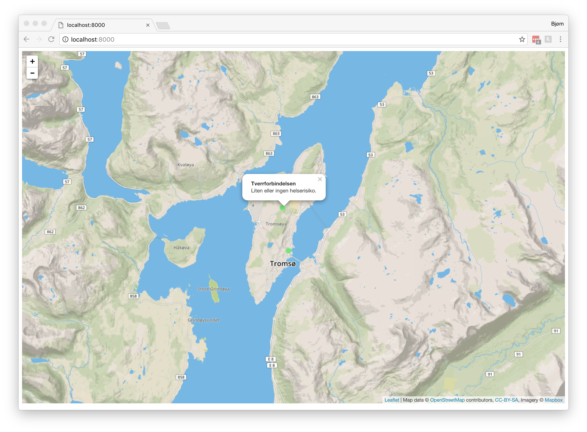

# Luft
Visualizing air quality in Tromsø



# Setup Wiki server

```console
ssh airbit@ifi-web3.ifi.uit.no

cd ./blocklyduino

docker stop blocklyduino && docker rm blocklyduino
git pull && docker build -t blocklyduino .
docker run -d -p 8080:8080 --restart=always --name blocklyduino -t blocklyduino

exit
```
