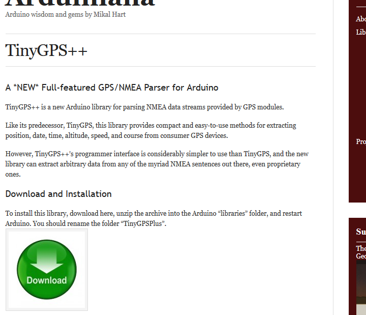

Neste komponent vi kan se nærmere på er GPS-antennen til air:bit. Igjen kommer vi til å sjekke GPS posisjonen og skrive ut dataen fra GPS-en til seriell kommunikasjon. Men for å gjøre ting litt mer interessant kommer vi også til å lyse opp LED-lysene for å vise at du har kontakt med nok GPS-satellitter til å kunne bestemme posisjon.

Bruk av LED-lysene for å vise GPS signal kan være en god idé, siden det fort kan skje at man mister kontakt med GPS-en avhengig av vær- og terrengforhold, fjell eller tunneller på veien. Det vil også være mye vanskeligere å få GPS-kontakt når du er inne i hus, spesielt om huset har tykke betongvegger. Når du går rundt ute og tar målinger forventes det ikke at du har en datamaskin koblet til air:bit hele tiden for å kunne lese ut tekst du sender ut via seriell-koblingen.

## Ny Sketch

Igjen vil vi starte med en tom Sketch. Du kan klikke på _Discard_ knappen for å slette den tidligere koden. Du kan også trykke på _Save XML_ for å lagre prosjektet til senere.

## Laste ned og installere `TinyGPS++` biblioteket

Igjen skal vi bruke et bibliotek du ikke finner i `Library Manager`. Klikk på følgende link for å laste ned: **[TinyGPS++ Biblioteket][tiny-gpp-dl-link]**

[][tiny-gpp-dl-link]

Klikk på den store grønne pilen der det står Download. Husk å ikke åpne filen, men lagre den!

Åpne en `Arduino IDE`. I `Arduino IDE` programmet, finn menyen `Sketch`&rarr;`Include library`&rarr;`Add ZIP library` og velg filen du nettopp lastet ned.

## Laste ned og installere air:bit biblioteker

UiT har laget noen biblioteker for å gjøre air:bit koden mer håndterbar. Vi har to hjelpebiblioteker. Begge kan bli hentet ifra [BlocklyDuino](http://airbit.uit.no:8080) siden. Ved å klikke på _Download Project_ knappen, og de forskjellige pop-up vinduene som dukker opp, får man en `.zip` fil ut. Ved å pakke ut filen får du en mappe som inneholder en til `.zip` fil, kalt _lib.zip_. Denne filen må du også pakke ut. Inne i _lib_ mappen vil du finne to `.zip` filer. Disse filene er hjelpebibliotekene. De kan vi installere som vi har gjort på tidligere vis.

Åpne en `Arduino IDE`. I `Arduino IDE` programmet, finn menyen `Sketch`&rarr;`Include library`&rarr;`Add ZIP library` og velg de filene du pakket ut.

# helplink

## Kodeblokker

GPS-en forteller oss om den har en gyldig posisjon. I tillegg til å skrive ut teksten over USB-ledningen til datamaskinen, vil vi bruke LED-lysene for å blinke grønt når vi har kontakt med GPS-satellittene og blinke rødt når vi ikke får kontakt. Dette betyr at vi må gjøre litt sjekking etter feilkoder.

Først må vi instruere Arduinoen til å prøve å oppdatere GPS informasjonen sin. Vi bruker `GPS update Data`-blokken i _Air:Bit; GPS_ sidefanen for å gjøre dette. Blokken vil _høre_ etter innkommende data fra GPS-en, samt forsikre seg om at en fullstending GPS måling blir gjort.

Vi kan se at de fleste `GPS`-blokkene krever en `GPS_RX` og en `GPS_TX` verdi. De riktige verdiene for disse kan du finne i [pinout skjemaet][pinout]. Verdiene vil være `RX` og `TX` pinnene for GPS-antennen.

![][skjermbilde-update-GPS-blockly]

Etter denne blokken kan vi være sikre på at vi har fått informasjon fra GPS-en. La oss nå sjekke om vi har en gyldig posisjon. Vi bruker `GPS is Valid`-blokken for dette. Denne blokken returner enten `true` eller `false`, altså er det en sannhetsverdi (`bool`). Deklarer en variabel med navnet `gpsValid`, gi den typen `bool` og koble `GPS`-blokken til den. 

Dersom du har fått kontakt med satellitter for å så ha mistet kontakten igjen (f.eks. fordi du går inn i en tunnel, et hus med tykke vegger, o.l.) vil `GPS is Valid`-blokken fortsette å gi `true` som svar, derfor må vi også sjekke om dataen har blitt oppdatert siden siste gang vi leste av. Vi bruker `GPS is Updated`-blokken for dette. Deklarer en ny `bool` variabel som tar imot denne verdien.

![][skjermbilde-variables-GPS-blockly]

En tommelfingerregel i programmering er at man bør gjøre håndtering av feil øverst i koden sin. Dvs. sjekk først for alle feil. Dette gjøres fordi det som regel er enklere å teste mot spesifikke feilbetingelser. 

For at GPS informasjonen skal være nyttig må den være både _Valid_ og _Updated_. Man kan sjekke om begge variablene er sanne bruker ved å bruke en `Logical AND`-blokk, som vi finner under _Logic_ sidefanen. `Logical And` betyr *OG*, dvs. begge betingelse må være `true` for at hele betingelsen skal være `true`.

Trekk en `Logical AND`-blokk ut og koble de forrige to blokkene til den. Deklarer en tredje `bool` variabel som heter `isUseful` som tar inn verdien fra `Logical And`-blokken, slik at verdien blir lagret.

![][skjermbilde-and-GPS-blockly]

Hvis dataen ikke er brukbar, trenger vi ikke å gå videre i programmet. Trekk ut en `if - do`-blokk fra _Logic_ sidefanen som skal verifisere brukbarheten. Siden vi skal reagere på at `isUseful` ikke skal være sann, må vi transformere verdien for å kunne bruke den riktig. Vi må få en sann verdi når `isUseful` er usann, og omvendt. Dette gjør vi med en `not`-blokk, som vi finner under _Logic_ sidefanen.

Når vi ikke har brukbar data, har vi lyst til å blinke det røde lyset, for så å starte `loop`-funksjonen på nytt. Hvis vi har brukbar data, blinker vi med det grønne lyset.

Vi kan starte `loop`-funksjonen på nytt med `Ends Function`-blokken som finnes under _Control_ sidefanen. Denne blokken avslutter funksjonen den er under, men siden `loop`-funksjonen starter på nytt når den blir avsluttet fungerer den som en omstart.

![][skjermbilde-check-GPS-blockly]

Nå som vi vet at vi har brukbar data kan vi hente ut informasjonen og skrive det ut over seriellforbindelsen. Informasjonen vi ønsker er GPS posisjonen, altså lengde- og breddegradene, samt tiden for målingen.

Lengde- og breddegradene hentes ut som variabler av typen `double`. Man får lengdegraden fra en blokk som heter `GPS Longitude`, og breddegraden fra `GPS Latitude` blokken.

Tiden får man fra `Get DateTime`-blokken. Denne returnerer en spesiell type kalt `AirBitDateTimeClass`. Deklarer en variabel av denne typen og hekt den sammen med `Get DateTime` blokken. 

Lengde- og breddegradene kan man skrive ut over seriellforbindelsen på samme måte som tidligere, men tiden må skrives ut med en egen blokk. Denne blokken heter `Print DateTime`, og finnes under _Air:Bit; GPS_ sidefanen. Koble _Tid_ variabelen til `Print DateTime` blokken for å skrive ut tidsinformasjonen.

Sett på en `Delay`-blokk til slutt for å gi arduinoen litt tid mellom hver måling.

![][skjermbilde-GPS-print-blockly]

## Ferdig

Koden din skal nå se slik ut:

![][skjermbilde-GPS-blockly]

![][skjermbilde-GPS-print-blockly]

Kodelinjene bør også se slik ut:

```cpp
#include <TinyGPS++.h>
#include <SoftwareSerial.h>
#include <AirBitUtilsClass.h>

#include <AirBitDateTimeClass.h>

int gpsUpdated;

int gpsValid;

int isUseful;

int Latitude;

int Longitude;

int Tid;

#define GPS_RX 7
#define GPS_TX 6

SoftwareSerial gpsCom(GPS_RX, GPS_TX);
TinyGPSPlus gps;

AirBitUtilsClass airbitUtils;

#define LED_RED A1
#define LED_GREEN A0

void setup()
{
  gpsCom.begin(9600); // Initialize serial communication to GPS antenna

  Serial.begin(9600);

  pinMode(LED_RED, OUTPUT);

  pinMode(LED_GREEN, OUTPUT);

}


void loop()
{
  gpsCom.listen();
  airbitUtils.WaitOnGpsEncoding(&gps, &gpsCom);
  gpsUpdated = gps.location.isUpdated();
  gpsValid = gps.location.isValid();
  isUseful = ( gpsUpdated && gpsValid );
  if (!isUseful) {
    Serial.println("Ingen gyldig GPS posisjon");
    digitalWrite(LED_RED, HIGH);
    delay(500);
    digitalWrite(LED_RED, LOW);
    return;

  }
  digitalWrite(LED_GREEN, HIGH);
  delay(500);
  digitalWrite(LED_GREEN, LOW);
  Latitude = gps.location.lat();
  Longitude = gps.location.lng();
  Tid = airbitUtils.GetDateTime(gps);
  Serial.println(Latitude);
  Serial.println(Longitude);
  Tid.PrintSerial();
  delay(2500);

}
```

## Last ned koden

For å kunne kjøre koden må du laste den ned. Dette gjør du ved å trykke på _Save Arduino Code_ knappen på [BlocklyDuino siden](http://airbit.uit.no:8080). Du kan velge hva filen din skal hete. Gå så til hvor du lastet ned filen og åpne filen med `Arduino IDE`-programmet. Den vil spørre deg om å lage en en mappe med samme navn som filen, godta forespørselen. Du kan så overføre koden til Arduinoen som vanlig, ved å trykke på _Last Opp_ knappen (den høyrepekende pilen). 

## Gå videre

&uarr; [Gå til **innholdsfortegnelsen**][home]  
&larr; [Gå tilbake forrige neste steg i Blokkprogrammeringen: **Støvsensoren**][pm]  
&rarr; [Gå til neste steg i Blokkprogrammeringen: **SD-kortet og filer**][sd]  

[tiny-gpp-dl-link]: http://arduiniana.org/libraries/tinygpsplus/
[tiny-ggp-dl-img]: TinyGPSPlusPlus-library-download.png

[home]: airbit-Programmering
[pm]: Programmering-med-Støvsensoren-Blokkprogrammering
[sd]: Programmering-av-filer-på-SD-kortet-Blokkprogrammering

[pinout]: airbit-Pinout
[debugging-var-out-of-scope]: Feilsøking-av-programmeringsfeil#bruk-av-variabler-utenfor-scope

[skjermbilde-update-GPS-blockly]: skjermbilde-update-GPS-blockly.png
[skjermbilde-variables-GPS-blockly]: skjermbilde-variables-GPS-blockly.png
[skjermbilde-and-GPS-blockly]: skjermbilde-and-GPS-blockly.png
[skjermbilde-check-GPS-blockly]: skjermbilde-check-GPS-blockly.png
[skjermbilde-GPS-print-blockly]: skjermbilde-GPS-print-blockly.png
[skjermbilde-GPS-blockly]: skjermbilde-GPS-blockly.png
